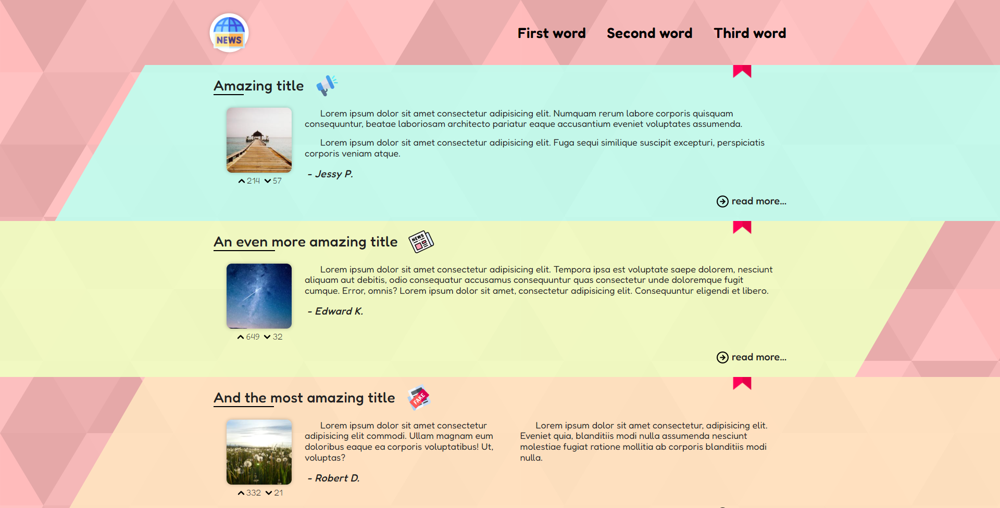

# Amnews

📄 **amnews** - это просто моя веб-наработка, с использованием части ранее изученных технологий и применением основ чистого **JavaScript**. Дизайн был придуман на ходу и по мере работы, [не отличается умом и сообразительностью](https://clck.ru/gMMhP) ~

---

## about:

📑 При написании верстки использовал препроцессор **Pug**, для фрагментирования страницы и гибкости поддержки. Так же методология **BEM** для классификации элементов. При написании стилей использовался препроцессор **SASS** с одноименным синтаксисом.

- 📝 Это был мой первый опыт использования **JavaScript** на практике и мне удалось реализовать:
  - Определение устройства просмотра страницы;
  - Классическое бургер-меню для адаптива;
  - Многофункциональный слайдер;
  - Подключение библиотеки [NProgress.js](https://ricostacruz.com/nprogress/), с помощью JQuery;

---

## warning:

> 📌 _Работа над проектом прекращена:_
>
> > **amnews** _- это не адаптивный проект._
>
> **P.s.** _- здесь много легаси и не валидного кода._

---

<h1 align="center"><a href="https://lapard1n.github.io/amnews">amnews:</a></h1>

---
