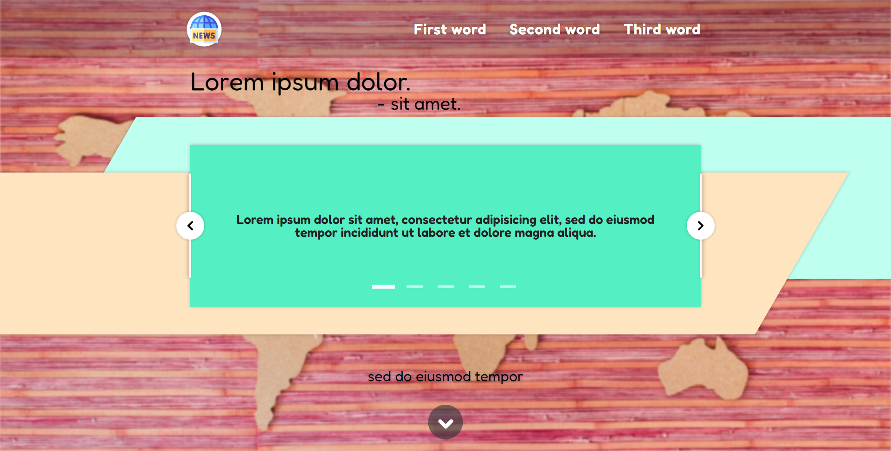

# amnews:

**amnews** - мой первый полноценный **Front-end** проект, с использованием всех ранее изученных технологий и применением основ нативного **JavaScript**. Дизайн придумывался на ходу и по мере работы, без сильного акцента на нем.

---

## about:

* При написании верстки использовал препроцессор **Pug**, встроив расширения и фрагментировав основную страницу.
  * Так же методология **BEM** при классификации элементов.
* При написании стилей использовался препроцессор **SASS** впервые с одноименном синтаксисом.
* Это был мой первый опыт использования **JavaScript** на практике с прикладным применением, мне удалось реализовать:
  * ...
  * ...
  * ...
* В заключении была применена кроссбраузерная отзывчевая адаптивная верстка.

---

## warning:

> *находится в разработке**

---

<h1 align="center"><a href="https://lapard1n.github.io/amnews">amnews:</a></h1>

---
